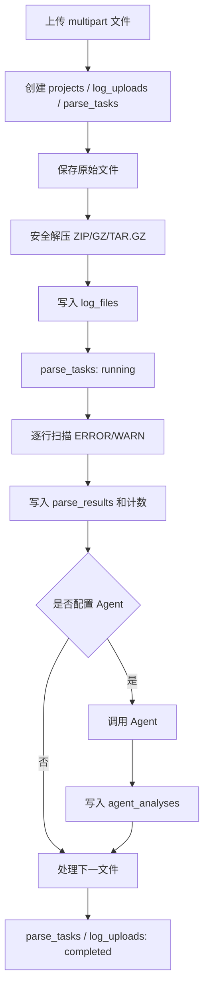

# LogMaster 数据库设计文档

版本：当前工作区实现  
数据库：PostgreSQL 15+  
驱动：`github.com/jackc/pgx/v5/stdlib`  
应用 Schema：`logmaster_api`

## 1. 设计目标

数据库用于保存：

- 日志项目和上传记录
- 原始/解压后日志文件元数据
- 本地解析任务和命中结果
- Agent 诊断结果
- 动态解析规则
- 测试场景配置
- 数据库迁移版本

原始日志正文不直接写入 PostgreSQL，而是保存在 `LOG_STORAGE_DIR` 文件系统目录中；数据库只保存路径、大小、SHA-256 和解析统计。

## 2. Schema 隔离

所有新后端表位于：

```sql
logmaster_api
```

后端启动时自动执行：

```sql
CREATE SCHEMA IF NOT EXISTS logmaster_api;
```

使用独立 Schema 的原因：

- 避免与已有 `public` 表重名。
- 避免破坏旧系统表和数据。
- 方便权限隔离、备份和整体迁移。
- 所有 SQL 都显式使用 `logmaster_api.<table>`，不依赖 `search_path`。

## 3. 表关系

```mermaid
erDiagram
    PROJECTS ||--o{ LOG_UPLOADS : "project_id"
    LOG_UPLOADS ||--o{ LOG_FILES : "upload_id / CASCADE"
    LOG_UPLOADS ||--|| PARSE_TASKS : "upload_id / CASCADE"
    PARSE_TASKS ||--o{ PARSE_RESULTS : "task_id / CASCADE"
    LOG_FILES ||--o{ PARSE_RESULTS : "log_file_id / CASCADE"
    PARSE_TASKS ||--o{ AGENT_ANALYSES : "task_id / CASCADE"
    LOG_FILES ||--o{ AGENT_ANALYSES : "log_file_id / CASCADE"

    PROJECTS {
        bigint id PK
        varchar name UK
    }
    LOG_UPLOADS {
        uuid id PK
        bigint project_id FK
        varchar status
        text storage_path
    }
    LOG_FILES {
        bigint id PK
        uuid upload_id FK
        text relative_path
        char sha256
    }
    PARSE_TASKS {
        uuid id PK
        uuid upload_id FK_UK
        varchar status
    }
    PARSE_RESULTS {
        bigint id PK
        uuid task_id FK
        bigint log_file_id FK
        varchar level
    }
    AGENT_ANALYSES {
        bigint id PK
        uuid task_id FK
        bigint log_file_id FK
        varchar provider
        jsonb findings
    }
```

`parse_rules` 和 `test_scenarios` 当前是独立配置表，尚未建立到解析任务的版本化外键关系。

## 4. 表清单

| 表名 | 说明 |
| --- | --- |
| `schema_migrations` | 已执行迁移版本 |
| `projects` | 项目名称 |
| `log_uploads` | 一次上传会话 |
| `log_files` | 上传或解压得到的日志文件 |
| `parse_tasks` | 上传对应的解析任务 |
| `parse_results` | ERROR/WARN 等本地匹配结果 |
| `agent_analyses` | Agent 对单个日志文件的诊断 |
| `parse_rules` | 可配置解析规则 |
| `test_scenarios` | 测试场景及检查项 |

## 5. `schema_migrations`

记录后端已经执行的 SQL 迁移。

| 字段 | 类型 | 约束 | 说明 |
| --- | --- | --- | --- |
| `version` | TEXT | PK | 迁移文件名 |
| `applied_at` | TIMESTAMPTZ | NOT NULL, DEFAULT NOW() | 执行时间 |

当前迁移：

```text
001_logs.sql
002_agent_analyses.sql
003_configuration.sql
```

迁移按文件名排序，每个迁移在独立事务中执行；成功后才写入版本记录。

## 6. `projects`

保存日志所属项目。

| 字段 | 类型 | 约束 | 说明 |
| --- | --- | --- | --- |
| `id` | BIGSERIAL | PK | 项目主键 |
| `name` | VARCHAR(128) | NOT NULL, UNIQUE | 项目名称 |
| `created_at` | TIMESTAMPTZ | NOT NULL, DEFAULT NOW() | 创建时间 |

上传时通过项目名称执行 Upsert。删除最后一个上传任务时，业务代码会删除没有任何上传记录引用的空项目。

`log_uploads.project_id` 未配置数据库级 `ON DELETE CASCADE`，因此不能直接删除仍被上传记录引用的项目。

## 7. `log_uploads`

表示一次上传会话。一次上传可以包含一个或多个源文件。

| 字段 | 类型 | 约束 | 说明 |
| --- | --- | --- | --- |
| `id` | UUID | PK | 上传 ID，由后端生成 |
| `project_id` | BIGINT | NOT NULL, FK | 关联 `projects.id` |
| `version` | VARCHAR(64) | NOT NULL, DEFAULT `''` | 固件/软件版本 |
| `status` | VARCHAR(24) | NOT NULL, CHECK | 上传和解析状态 |
| `original_name` | TEXT | NOT NULL, DEFAULT `''` | 原始文件名；多个文件用逗号拼接 |
| `original_size` | BIGINT | NOT NULL, >= 0 | 上传原始字节数 |
| `storage_path` | TEXT | NOT NULL | 该上传任务的文件系统根目录 |
| `error_message` | TEXT | NOT NULL, DEFAULT `''` | 失败原因 |
| `created_at` | TIMESTAMPTZ | NOT NULL, DEFAULT NOW() | 创建时间 |
| `updated_at` | TIMESTAMPTZ | NOT NULL, DEFAULT NOW() | 更新时间 |

状态值：

```text
uploading
queued
parsing
completed
failed
```

状态流转：

```text
uploading -> queued -> parsing -> completed
                         \-----> failed
```

索引：

```sql
idx_log_uploads_created_at (created_at DESC)
idx_log_uploads_project_id (project_id)
```

## 8. `log_files`

保存一次上传最终参与解析的每个日志文件。

| 字段 | 类型 | 约束 | 说明 |
| --- | --- | --- | --- |
| `id` | BIGSERIAL | PK | 文件主键 |
| `upload_id` | UUID | NOT NULL, FK, CASCADE | 关联 `log_uploads.id` |
| `relative_path` | TEXT | NOT NULL | 相对上传根目录的内部路径 |
| `size_bytes` | BIGINT | NOT NULL, >= 0 | 文件大小 |
| `sha256` | CHAR(64) | NOT NULL | 文件 SHA-256 |
| `line_count` | BIGINT | NOT NULL, >= 0, DEFAULT 0 | 解析后的行数 |
| `created_at` | TIMESTAMPTZ | NOT NULL, DEFAULT NOW() | 创建时间 |

唯一约束：

```sql
UNIQUE (upload_id, relative_path)
```

索引：

```sql
idx_log_files_upload_id (upload_id)
```

路径示例：

```text
items/1/original/logfile_0
items/2/extracted/system/logfile_1
```

路径含义：

- `items/1`：本次上传的第 1 个源文件。
- `original`：直接上传的普通日志。
- `extracted`：从压缩包解压得到的日志。
- 后续部分：文件在源文件或压缩包中的相对路径。

数据库路径不是用户电脑的源路径，也不是独立的绝对服务器路径。实际完整路径为：

```text
<LOG_STORAGE_DIR>/<upload_id>/<relative_path>
```

## 9. `parse_tasks`

每个上传会话对应一个解析任务。

| 字段 | 类型 | 约束 | 说明 |
| --- | --- | --- | --- |
| `id` | UUID | PK | 任务 ID |
| `upload_id` | UUID | NOT NULL, UNIQUE, FK, CASCADE | 一对一关联上传 |
| `status` | VARCHAR(24) | NOT NULL, CHECK | 任务状态 |
| `total_files` | INTEGER | NOT NULL, DEFAULT 0 | 文件总数 |
| `processed_files` | INTEGER | NOT NULL, DEFAULT 0 | 已处理文件数 |
| `total_lines` | BIGINT | NOT NULL, DEFAULT 0 | 日志总行数 |
| `error_count` | BIGINT | NOT NULL, DEFAULT 0 | 错误匹配数 |
| `warning_count` | BIGINT | NOT NULL, DEFAULT 0 | 警告匹配数 |
| `error_message` | TEXT | NOT NULL, DEFAULT `''` | 失败原因 |
| `started_at` | TIMESTAMPTZ | NULL | 开始解析时间 |
| `completed_at` | TIMESTAMPTZ | NULL | 完成或失败时间 |
| `created_at` | TIMESTAMPTZ | NOT NULL, DEFAULT NOW() | 创建时间 |
| `updated_at` | TIMESTAMPTZ | NOT NULL, DEFAULT NOW() | 更新时间 |

状态值：

```text
queued
running
completed
failed
```

## 10. `parse_results`

保存本地解析器命中的日志行。

| 字段 | 类型 | 约束 | 说明 |
| --- | --- | --- | --- |
| `id` | BIGSERIAL | PK | 结果主键 |
| `task_id` | UUID | NOT NULL, FK, CASCADE | 关联 `parse_tasks.id` |
| `log_file_id` | BIGINT | NOT NULL, FK, CASCADE | 关联 `log_files.id` |
| `level` | VARCHAR(16) | NOT NULL | `error` 或 `warning` |
| `matched_text` | TEXT | NOT NULL | 命中的关键字 |
| `line_number` | BIGINT | NOT NULL | 文件中的行号 |
| `content` | TEXT | NOT NULL | 日志行内容，最多保存前 4000 字节 |
| `created_at` | TIMESTAMPTZ | NOT NULL, DEFAULT NOW() | 创建时间 |

当前本地解析器识别：

```text
FATAL   -> error
ERROR   -> error
WARNING -> warning
WARN    -> warning
```

每个文件最多持久化前 `2000` 条命中记录，但任务计数会统计所有命中行。

索引：

```sql
idx_parse_results_task_id_level (task_id, level)
```

## 11. `agent_analyses`

保存 Agent 对单个日志文件的分析结果。

| 字段 | 类型 | 约束 | 说明 |
| --- | --- | --- | --- |
| `id` | BIGSERIAL | PK | Agent 结果主键 |
| `task_id` | UUID | NOT NULL, FK, CASCADE | 关联解析任务 |
| `log_file_id` | BIGINT | NOT NULL, FK, CASCADE | 关联日志文件 |
| `provider` | VARCHAR(64) | NOT NULL | Agent 提供者，当前为 `http-agent` |
| `status` | VARCHAR(24) | NOT NULL, CHECK | `completed` 或 `failed` |
| `summary` | TEXT | NOT NULL, DEFAULT `''` | Agent 总结 |
| `findings` | JSONB | NOT NULL, DEFAULT `[]` | 结构化诊断项 |
| `error_message` | TEXT | NOT NULL, DEFAULT `''` | 调用或解析错误 |
| `created_at` | TIMESTAMPTZ | NOT NULL, DEFAULT NOW() | 创建时间 |
| `updated_at` | TIMESTAMPTZ | NOT NULL, DEFAULT NOW() | 更新时间 |

唯一约束：

```sql
UNIQUE (task_id, log_file_id, provider)
```

重复执行同一 Agent 时使用 Upsert 更新原记录。

`findings` JSON 示例：

```json
[
  {
    "category": "recording",
    "severity": "error",
    "root_cause": "摄像头初始化超时",
    "suggestion": "检查连接和初始化顺序",
    "evidence": "ERROR camera init failed",
    "confidence": 0.92
  }
]
```

索引：

```sql
idx_agent_analyses_task_id (task_id)
```

## 12. `parse_rules`

保存前端维护的动态解析规则。

| 字段 | 类型 | 约束 | 说明 |
| --- | --- | --- | --- |
| `id` | BIGSERIAL | PK | 规则主键 |
| `name` | VARCHAR(128) | NOT NULL | 规则名称 |
| `category` | VARCHAR(32) | NOT NULL | 规则分类 |
| `keyword` | TEXT | NOT NULL | 关键字或表达式 |
| `scope` | VARCHAR(128) | NOT NULL, DEFAULT `''` | 适用范围 |
| `level` | VARCHAR(16) | NOT NULL, CHECK | `critical`、`warning`、`info` |
| `enabled` | BOOLEAN | NOT NULL, DEFAULT TRUE | 是否启用 |
| `description` | TEXT | NOT NULL, DEFAULT `''` | 规则说明 |
| `created_at` | TIMESTAMPTZ | NOT NULL, DEFAULT NOW() | 创建时间 |
| `updated_at` | TIMESTAMPTZ | NOT NULL, DEFAULT NOW() | 更新时间 |

索引：

```sql
idx_parse_rules_category (category)
```

当前状态：CRUD 和持久化已完成，但本地解析器尚未动态加载该表。

## 13. `test_scenarios`

保存测试场景以及场景检查项。

| 字段 | 类型 | 约束 | 说明 |
| --- | --- | --- | --- |
| `id` | VARCHAR(64) | PK | 场景 ID |
| `name` | VARCHAR(128) | NOT NULL | 场景名称 |
| `description` | TEXT | NOT NULL, DEFAULT `''` | 场景说明 |
| `color` | VARCHAR(24) | NOT NULL, DEFAULT `blue` | 前端标识颜色 |
| `judgement` | VARCHAR(32) | NOT NULL, DEFAULT `any-error` | 判定方式 |
| `checks` | JSONB | NOT NULL, DEFAULT `[]` | 检查项数组 |
| `created_at` | TIMESTAMPTZ | NOT NULL, DEFAULT NOW() | 创建时间 |
| `updated_at` | TIMESTAMPTZ | NOT NULL, DEFAULT NOW() | 更新时间 |

`checks` 示例：

```json
[
  {
    "id": "unexpected-reboot",
    "name": "异常重启",
    "description": "识别非预期重启",
    "severity": "critical",
    "enabled": true,
    "keywords": ["POWER_ID_SWRT", "backtrace"]
  }
]
```

当前状态：CRUD 和持久化已完成，但尚未参与解析任务编排，也没有场景版本快照。

## 14. 删除和级联规则

删除 `log_uploads` 时，PostgreSQL 自动级联删除：

```text
log_uploads
  -> log_files
       -> parse_results
       -> agent_analyses
  -> parse_tasks
       -> parse_results
       -> agent_analyses
```

业务层删除任务时还会：

1. 查询上传记录的 `storage_path`。
2. 在事务中删除上传记录。
3. 删除没有任何上传记录引用的空项目。
4. 校验路径必须位于 `LOG_STORAGE_DIR` 内。
5. 删除对应文件系统目录。

数据库事务和文件系统删除无法组成一个原子事务，因此存在“数据库已删除但文件清理失败”的可能；接口会返回明确错误。

## 15. 文件存储结构

默认根目录：

```text
data/logs
```

目录示例：

```text
data/logs/
└── <upload_id>/
    ├── items/
    │   ├── 1/
    │   │   ├── original/
    │   │   │   └── logfile
    │   │   └── extracted/
    │   │       ├── logfile_0
    │   │       └── logfile_1
    │   └── 2/
    │       └── original/
    │           └── system.log
    └── ...
```

上传预检使用临时目录：

```text
data/logs/.inspect/<random_uuid>/
```

预检请求结束后自动删除。

## 16. 数据写入流程



## 17. 仪表板查询来源

仪表板数据全部实时聚合：

| 指标 | 来源 |
| --- | --- |
| 日志总行数 | `SUM(parse_tasks.total_lines)` |
| 错误数 | `SUM(parse_tasks.error_count)` |
| 警告数 | `SUM(parse_tasks.warning_count)` |
| 任务数 | `COUNT(parse_tasks)` |
| 完成/失败任务 | 按 `parse_tasks.status` 过滤 |
| 每日趋势 | 按 `parse_tasks.created_at::date` 聚合 |
| 关键字排行 | 按 `parse_results.matched_text` 聚合 |
| 最近任务 | `log_uploads.created_at DESC` |

## 18. 常用查询

查看迁移版本：

```sql
SELECT version, applied_at
FROM logmaster_api.schema_migrations
ORDER BY version;
```

查看任务状态：

```sql
SELECT t.id, u.original_name, p.name AS project,
       t.status, t.total_files, t.processed_files,
       t.total_lines, t.error_count, t.warning_count
FROM logmaster_api.parse_tasks t
JOIN logmaster_api.log_uploads u ON u.id = t.upload_id
JOIN logmaster_api.projects p ON p.id = u.project_id
ORDER BY t.created_at DESC;
```

查看某个任务的错误日志：

```sql
SELECT f.relative_path, r.line_number, r.matched_text, r.content
FROM logmaster_api.parse_results r
JOIN logmaster_api.log_files f ON f.id = r.log_file_id
WHERE r.task_id = '<task_uuid>'
  AND r.level = 'error'
ORDER BY f.id, r.line_number;
```

查看 Agent 失败记录：

```sql
SELECT task_id, log_file_id, provider, error_message, updated_at
FROM logmaster_api.agent_analyses
WHERE status = 'failed'
ORDER BY updated_at DESC;
```

## 19. 备份与恢复

只备份 LogMaster Schema：

```powershell
pg_dump -h 127.0.0.1 -U logmaster -d logmaster `
  --schema=logmaster_api `
  --format=custom `
  --file=logmaster_api.backup
```

恢复：

```powershell
pg_restore -h 127.0.0.1 -U logmaster -d logmaster `
  --clean --if-exists `
  logmaster_api.backup
```

注意：数据库备份不包含 `LOG_STORAGE_DIR` 下的原始日志，必须同时备份文件目录，并保持数据库与文件快照时间一致。

## 20. 已知缺口与后续建议

1. 给 `parse_results.level` 增加 CHECK 约束。
2. 给任务计数字段增加非负 CHECK 约束。
3. 将 `parse_rules` 真正接入解析器，并记录任务使用的规则版本快照。
4. 给 `test_scenarios` 增加版本表，避免配置更新影响历史任务解释。
5. 为 Agent 增加独立任务表、重试次数、下次执行时间和幂等键。
6. 增加日志保留期限、清理时间和文件存在状态。
7. 增加数据库用户与业务用户的关联及审计字段。
8. 给大规模 `parse_results` 设计按时间或任务分区策略。
9. 为文件系统删除增加补偿任务和定期孤儿文件扫描。
10. 建立数据库与文件存储的一致性巡检任务。
